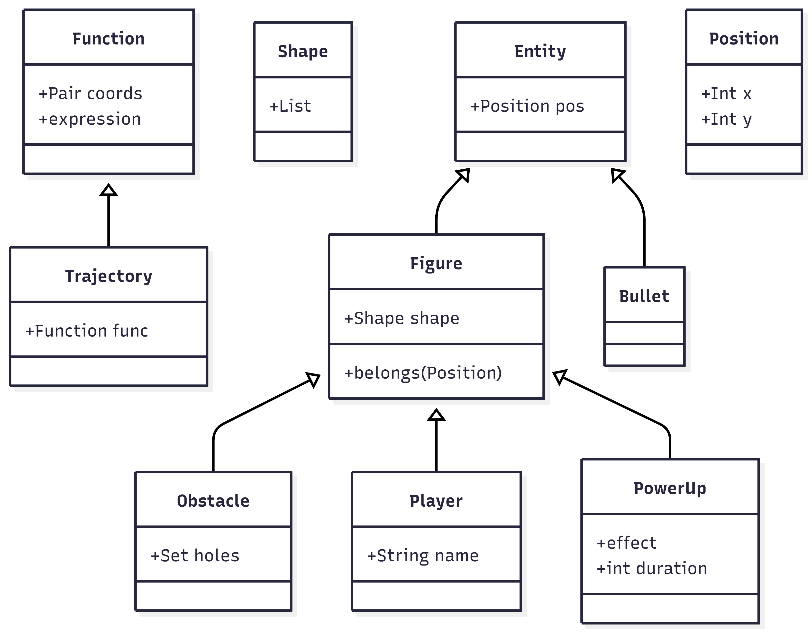

# Requisiti
In questa sezione sono esposti i requisiti emersi durante l'analisi del problema.

## Requisiti di business
Si deve realizzare un videogioco ambientato nel piano cartesiano in due dimensioni in cui il giocatore combatte tramite la scrittura di funzioni matematiche.
Il giocatore deve poter scrivere funzioni matematiche tramite cui *sparare* 
ai giocatori nemici, eliminandoli.
Tali funzioni 

## Modello di dominio
Il dominio include le seguenti entità:
- **Entity**: una generica entità con una posizione
- **Figure**: certe entità sono delle figure, cioè delle forme geometriche con una **Shape** (*forma*) e di si può determinare
l'appartenenza di un punto
- **Bullet**: un proiettile, appartenente ad un giocatore, che si muove lungo una traitettoria
- **Shape**: una forma geometrica che potrebbe essere espressa come un insieme di funzioni matematiche (equazioni, disequazioni... etc)
- **Trajectory**: la traitettoria di un proiettile
- **Position**: the position of an entity

Una *Figure* può essere di 3 tipi diversi: 
- **Obstacle**: una particolare figura geometrica che, quando colpita, possiede dei buchi generati dall'impatto con i proiettili
- **Player**: un giocatore
- **Power-up**: un particolare entità che, quando colpita, dona un effetto a chi la colpisce e scompare immediatamente

La figura seguente cattura gli aspetti elencati, includendo le relazioni tra le entità del dominio.

## Requisiti funzionali
- La **partita** può essere avviata con una composizione variabile di giocatori:
    - 1 vs. 1: Possono essere presenti due giocatori umani che giocano dalla stessa macchina
    - 1 vs. CPU: Può essere presente un giocatore umanno che gioca contro un giocatore controllato dal computer
- Le **funzioni**:
    - Continuano per la loro traiettoria una volta colpito un giocatore
    - Si fermano quando colpiscono gli ostacoli o i bordi della mappa
- Quando una funzione colpisce un'ostacolo, parte di esso viene rimosso (esplosione)
- La **mappa** (posizione e dimensione di ostacoli, posizione dei giocatori) deve essere generata casualmente e 
rispettare certi vincoli di usabilità:
    - I giocatori non devono essere troppo vicini agli ostacoli, al punto da rendere complicata la generazione di una 
    funzione che li possa aggirare
    - I giocatori non devono essere vicini tra di loro per non rischiare di essere colpiti dalla stessa funzione
- I **potenziamenti** (o *power-up*) sono ostacoli che, se colpiti da una funzione, si distruggono e donano al giocatore che li ha colpiti un'abilità speciale.

### Requisiti utente
I seguenti requisiti valgono per tutti i giocatori umani partecipanti al gioco.
L'utente potrà interagire con il sistema tramite l'interfaccia grafica (GUI).
L'utente potrà intraprendere le seguenti azioni:
- impostare il proprio nome
- iniziare una partita
- scrivere la funzione desiderata all'interno di una casella di testo
- sparare la funzione scritta
L'utente potrà visualizzare a schermo le seguenti informazioni:
- la disposizione dei giocatori e degli ostacoli
- riconoscere i giocatori nemici da quelli amici
- una volta sparata una funzione, vederne la traiettoria e gli oggetti colpiti
- vedere le funzioni sparate da altri giocatori

### Requisiti non funzionali
- Si deve realizzare un software ampliabile, predisposto all'aggiunta di altre entità di gioco definibili tramite i
componenti attuali
- L'interfaccia grafica e l'esperienza utente deveno essere chiare, fluide e comprensibili

## Requisiti di implementazione
- Scala 3.x
- TuProlog
- JDK