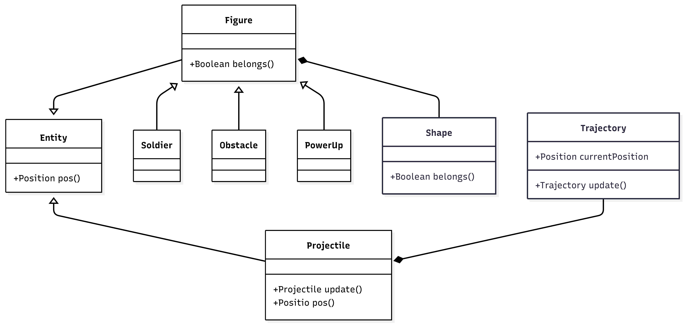

# Requisiti
In questa sezione sono esposti i requisiti emersi durante l'analisi del problema.

## Requisiti di business
Si deve realizzare un videogioco ambientato nel piano cartesiano bidimensionale in cui i giocatori combattono tramite la definizione di funzioni matematiche. L'obiettivo è colpire gli avversari sfruttando le proprietà geometriche delle funzioni e l'ambiente di gioco. Il gioco deve combinare competenze matematiche, strategia e precisione, offrendo partite competitive in scenari generati proceduralmente.

## Modello di dominio
Il dominio include le seguenti entità:
- **Entity**: entità generica caratterizzata da una posizione nello spazio di gioco.
- **Figure**: entità geometriche caratterizzate da una Shape. È possibile determinare se un punto appartenga alla figura.
- **Projectile**: un proiettile, appartenente ad un giocatore, che si muove lungo una traiettoria
- **Shape**: una rappresentazione geometrica definita tramite un predicato logico. Una Shape può essere ottenuta dalla composizione di più predicati.
- **Trajectory**: la traiettoria di un proiettile
- **Position**: la posizione di un Entity
- **Player**: rappresenta il partecipante alla partita

Una **Figure** può essere di 3 tipi diversi: 
- **Obstacle**: una particolare figura geometrica che, quando colpita, possiede dei buchi generati dall'impatto con i proiettili
- **Soldier**: rappresenta l'entità controllata da un giocatore e presente sul campo di gioco.
- **Power-up**: - I power-up, sono Figure che quando colpite da un proiettile, vengono distrutti e attribuiscono un effetto speciale al giocatore che li ha colpiti.

La figura seguente cattura gli aspetti elencati, includendo le relazioni tra le entità del dominio.

## Requisiti funzionali
- La **partita** può essere avviata con una composizione variabile di giocatori:
    - 1 vs. 1: Possono essere presenti due giocatori umani che giocano dalla stessa macchina
    - I giocatori agiscono a turni.
    - Durante il proprio turno un giocatore può inserire una funzione e spararla.
    - Al termine del lancio il turno passa al giocatore successivo.
    - Una partita termina quando tutti i soldati di un giocatore sono stati eliminati.
    - Vince il giocatore che possiede almeno un soldato sopravvissuto.
- Le **funzioni**:
    - Il sistema deve verificare la correttezza sintattica della funzione inserita dal giocatore.
    - Il sistema deve impedire il lancio di funzioni non valide.
    - In caso di errore, il sistema deve notificare il problema all'utente.
    - Un proiettile segue la sua traiettoria una volta colpito un giocatore
    - Si fermano quando colpiscono gli ostacoli o i bordi della mappa
    - Quando una funzione colpisce un ostacolo, parte di esso viene rimosso (esplosione)
- La **mappa** (posizione e dimensione di ostacoli, posizione dei giocatori) deve essere generata casualmente e 
rispettare certi vincoli di usabilità:
    - I giocatori non devono essere troppo vicini agli ostacoli, al punto da rendere complicata la generazione di una 
    funzione che li possa aggirare
    - I giocatori non devono essere vicini tra di loro per non rischiare di essere colpiti dalla stessa funzione
- I **potenziamenti** (o *power-up*) sono ostacoli che, se colpiti da un proiettile, si distruggono e donano al giocatore che li ha colpiti un'abilità speciale.

### Requisiti utente
I seguenti requisiti valgono per tutti i giocatori umani partecipanti al gioco.
L'utente potrà interagire con il sistema tramite l'interfaccia grafica (GUI).
L'utente potrà intraprendere le seguenti azioni:
- impostare il proprio nome
- iniziare una partita
- scrivere la funzione desiderata all'interno di una casella di testo
- sparare la funzione scritta
L'utente potrà visualizzare a schermo le seguenti informazioni:
- la disposizione dei giocatori e degli ostacoli
- riconoscere i giocatori nemici da quelli amici
- una volta sparata una funzione, vederne la traiettoria e gli oggetti colpiti
- vedere le funzioni sparate da altri giocatori

### Requisiti non funzionali
- Si deve realizzare un software ampliabile, predisposto all'aggiunta di altre entità di gioco definibili tramite i
componenti attuali
- L'interfaccia grafica deve consentire al giocatore di identificare chiaramente soldati, ostacoli, proiettili e power-up.

## Requisiti di implementazione
- Scala 3.x
- TuProlog
- JDK

___
___
[**&larr; Processo di sviluppo** ](./1-processo.md) | **Analisi dei requisiti** | [ **Design del sistema &rarr;**](./3-design.md)
 
[**Torna alla home**](../index.md)