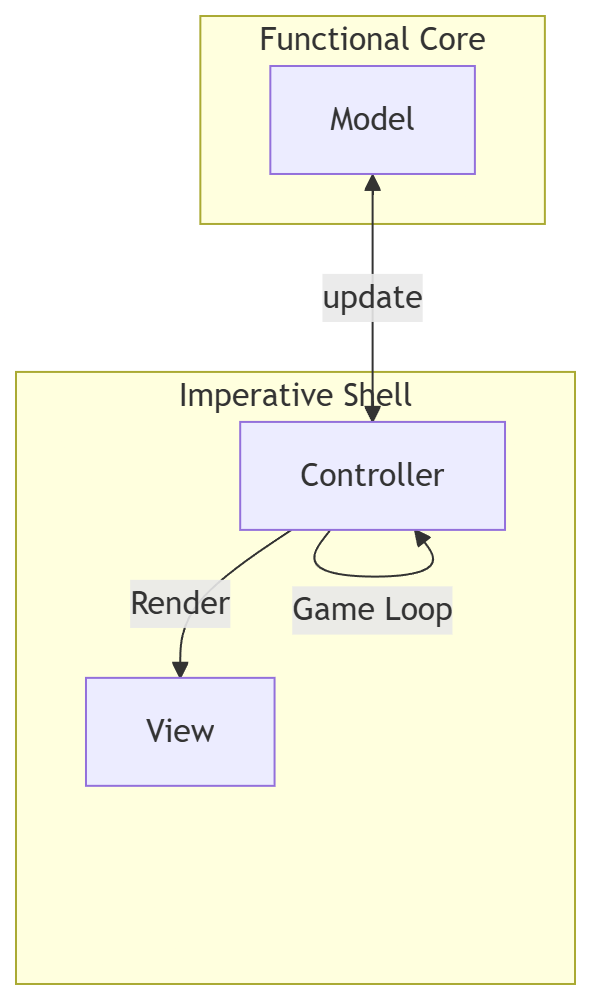

# Design architetturale
Per rispettare il principio di *Separation of Concerns* tra view e logica di business, favorendo l'immutabilità e uno sviluppo funzionale, viene adottato il pattern
Model-View-ViewModel (M-V-VM).

Questa scelta architetturale deriva dalla necessità di mantenere il più pulito ed astratto possibile il codice della logica di business, riferendosi al principio
**Functional Core, Imperative Shell**. L'architettura MVVM pone una barriera proprio tra View e Model, permettendo astrazione rispetto al livello di presentazione
ed evitando di *sporcare* il codice backend solo per necessità di convenienza, per esempio con dei *side-effect*s.

L'architettura è quindi divisa tra View (scritta tramite ScalaFX) ed un Model puramente funzionale connessi tramite un **Controller**
che si occupa dell'avvio del game-loop, aggiornamento del model e passaggio dei valori di input. Qui si può dire che siano *confinati* i side-effects.

L'architettura è rappresentata nel seguente diagramma:

## Model e ViewModel
La parte Model è concepita per essere puramente funzionale ed immutabile. Il Controller la aggiorna, ottenendo un
nuovo **stato del gioco** che può essere usato come *ViewModel* nel livello di rappresentazione.

## Controller
Il Controller si occupa di avviare il game loop e gestire le interazioni tra View e Model, si può dire che sia un'estensione della View in quanto rimane molto più *dipendente* dal comportamento di quest'ultima rispetto al Model, il quale invece potrebbe
essere visualizzato in qualsiasi maniera ed i suoi requisiti di utilizzo non cambierebbero.

In generale, si può dire che Controller e View *usano* il Model, lo aggiornano e ne ricavano i dati quando ne hanno bisogno a seconda della loro implementazione.

## View
Come conseguenza delle scelte architetturali, il ViewModel fornisce parecchia libertà alla implementazione specifica della View. Rimane comunque dipendente dall'implementazione del Controller, vista la necessità di passare valori in input e ricevere aggiornamenti.
In questo caso, è dichiarativa grazie all'utilizzo di ScalaFX. 

 
A questo fine viene sviluppato un componente **GameContext** che viene *osservato* dalla View per ricevere cambiamenti.

___
___
[**&larr; Analisi dei requisiti** ](./2-requisiti.md) | **Design del sistema** | [ **Design di dettaglio &rarr;**](./4-dettaglio.md)
 
[**Torna alla home**](../index.md)