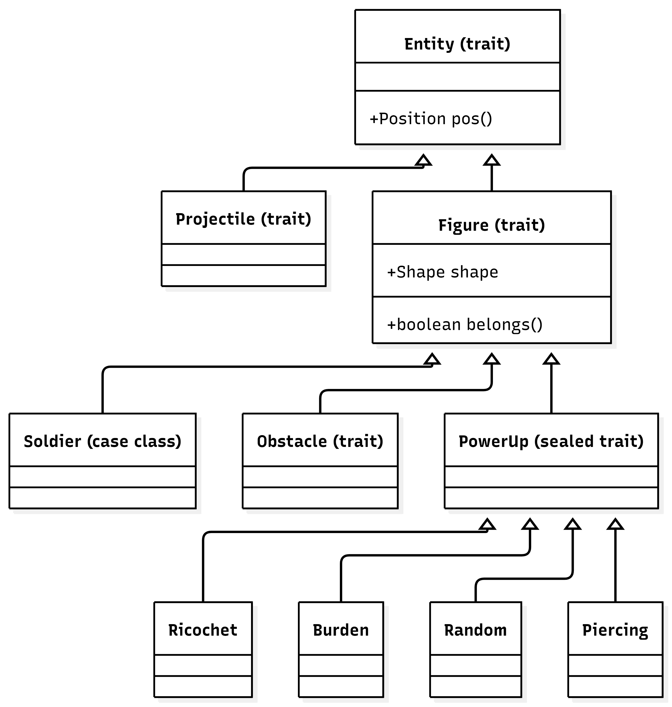

# Design di dettaglio
In questo capitolo viene approfondito il design del sistema, toccando gli aspetti fondamentali del Model menzionato al [Capitolo 3](3-design.md).

## GameState
Questo è il concetto fondante dell'intera architettura. Mantenere lo stato globale del gioco all'interno di una sola struttura dati immutabile si favorisce l'utilizzo funzionale del Model da parte dei suoi utenti.
Considerando la dimensione del dominio, questo concetto rimane comunque gestibile senza un'*esplosione*
di stati o sacrificarne la gestibilità.

## Parliamo di sta roba
Il dominio include le seguenti entità:
- **Entity**: una generica entità con una posizione
- **Figure**: certe entità sono delle figure, cioè delle forme geometriche con una **Shape** (*forma*) e di si può determinare
l'appartenenza di un punto
- **Bullet**: un proiettile, appartenente ad un giocatore, che si muove lungo una traitettoria
- **Shape**: una forma geometrica che potrebbe essere espressa come un insieme di funzioni matematiche (equazioni, disequazioni... etc)
- **Trajectory**: la traitettoria di un proiettile
- **Position**: the position of an entity

Una *Figure* può essere di 3 tipi diversi: 
- **Obstacle**: una particolare figura geometrica che, quando colpita, possiede dei buchi generati dall'impatto con i proiettili
- **Player**: un giocatore
- **Power-up**: un particolare entità che, quando colpita, dona un effetto a chi la colpisce e scompare immediatamente

- La **partita** può essere avviata con una composizione variabile di giocatori:
    - 1 vs. 1: Possono essere presenti due giocatori umani che giocano dalla stessa macchina
    - 1 vs. CPU: Può essere presente un giocatore umanno che gioca contro un giocatore controllato dal computer
- Le **funzioni**:
    - Continuano per la loro traiettoria una volta colpito un giocatore
    - Si fermano quando colpiscono gli ostacoli o i bordi della mappa
- Quando una funzione colpisce un'ostacolo, parte di esso viene rimosso (esplosione)
- La **mappa** (posizione e dimensione di ostacoli, posizione dei giocatori) deve essere generata casualmente e 
rispettare certi vincoli di usabilità:
    - I giocatori non devono essere troppo vicini agli ostacoli, al punto da rendere complicata la generazione di una 
    funzione che li possa aggirare
    - I giocatori non devono essere vicini tra di loro per non rischiare di essere colpiti dalla stessa funzione
- I **potenziamenti** (o *power-up*) sono ostacoli che, se colpiti da una funzione, si distruggono e donano al giocatore che li ha colpiti un'abilità speciale.

## Entità di gioco
Le entità di gioco sono organizzate secondo una gerarchia di trait che favorisce la composizione e la separazione delle responsabilità. La struttura è costruita su tre livelli di astrazione:

### Figure
Le Figure sono le entità di gioco fisicheche che occupano uno spazio definito da una Shape e possono interagire con i proiettili attraverso il rilevamento di collisioni. Questo design consente di applicare una logica di impatto uniforme a soldati, ostacoli e potenziamenti, indipendentemente dalla loro forma specifica mentre ognuna di queste gestisce la propria logica di gioco.

### Shape
La Shape è stata pensata come un predicato logico che astrae una figura geometrica. Tramite il metodo `belongs(pos: Position): Boolean`, la Shape verifica se una posizione ricade all'interno della geometria, abilitando il rilevamento delle collisioni tra proiettili e Figure. Le implementazioni concrete di Shape: Circle per forme semplici, Polygon per forme arbitrarie, e Difference per ostacoli danneggiati da esplosioni che consentono al sistema di collision detection di rimanere agnostico rispetto alla geometria specifica, mantenendo una logica uniforme e riusabile.

##

## MapGenerator
Il modulo MapGenerator gestisce la creazione procedurale della mappa adottando un pattern architetturale basato sull'evoluzione dello stato (`GameState => GameState`). Abbandonando l'uso di variabili globali o stati mutabili, l'algoritmo mappa il posizionamento spaziale come un flusso di dati continuo. La generazione multipla delle entità (ostacoli, power-up e soldati) è orchestrata tramite operazioni di `foldLeft`, che propagano esplicitamente lo stato aggiornato e immutabile da una fase di generazione alla successiva. Le dimensioni fisiche dell'area di gioco vengono totalmente disaccoppiate dalla logica di posizionamento tramite l'iniezione implicita della `BoundingBox` (`using border`), garantendo scalabilità su mappe di qualsiasi proporzione.

### Propagazione dello Spazio e Validazione Incrementale
Per evitare compenetrazioni (es. power-up generati sopra ostacoli o soldati), la gestione delle collisioni si affida a una mappatura dinamica degli ingombri fisici. Prima di ogni singolo spawn, il metodo `getOccupiedSpaces` interroga lo snapshot del `GameState` corrente per estrarre il footprint spaziale (coordinate X, Y e Raggio) di tutte le entità già posizionate.

Questo tracciato storico viene passato al motore logico esterno (`PrologMapChecker`), il quale esegue una validazione spaziale incrementale. Questo approccio risolve i colli di bottiglia degli algoritmi "Dart Throwing": anziché calcolare e validare l'intera mappa in blocco (con il rischio di doverla scartare e ricalcolare interamente per una singola sovrapposizione), il sistema interroga Prolog per singola coordinata. Se viene rilevata un'intersezione, la funzione di spawn sfrutta la ricorsione in coda (`@tailrec`) per scartare e rigenerare esclusivamente quel singolo punto, azzerando i tempi morti di inizializzazione.

### Specializzazione delle Entità
La logica di istanziazione si adatta proceduralmente alle caratteristiche geometriche e tattiche delle singole categorie di entità:

Ostacoli: Generati in modo interamente casuale all'interno dei limiti della mappa, con una suddivisione statistica paritaria (50% cerchi, 50% poligoni). I poligoni generano dinamicamente dai 3 ai 7 vertici; a questi viene assegnato un raggio di circoscrizione calcolato in fase di spawn per coprire preventivamente l'intera area che andranno a occupare prima del check di validazione.

Power-up: Ripartiti in modo statisticamente omogeneo (25% di probabilità per tipologia: `Ricochet`, `Burden`, `Random`, `Piercing`) negli spazi vuoti residui della mappa. Il raggio di validazione spaziale non è hardcoded, ma viene estratto polimorficamente dalla `Shape` dell'istanza appena creata.

Giocatori e Squadre: La mappa viene divisa strategicamente in due segmenti laterali (destro e sinistro), mantenendo un margine centrale di sicurezza (`safeMargin`) per evitare il corpo a corpo al primo turno. Il posizionamento avviene sequenzialmente: l'algoritmo istanzia i soldati del primo team, integrandoli nel `GameState`, e successivamente utilizza i loro stessi ingombri per validare gli spazi disponibili al posizionamento della squadra avversaria. Il raggio di collisione di ogni unità viene letto dinamicamente dalla relativa proprietà `shape`.
___
___
[**&larr; Design del sistema** ](./3-design.md) | **Design di dettaglio** | [ **Implementazione &rarr;**](./5-implementazione.md)
 
[**Torna alla home**](../index.md)
